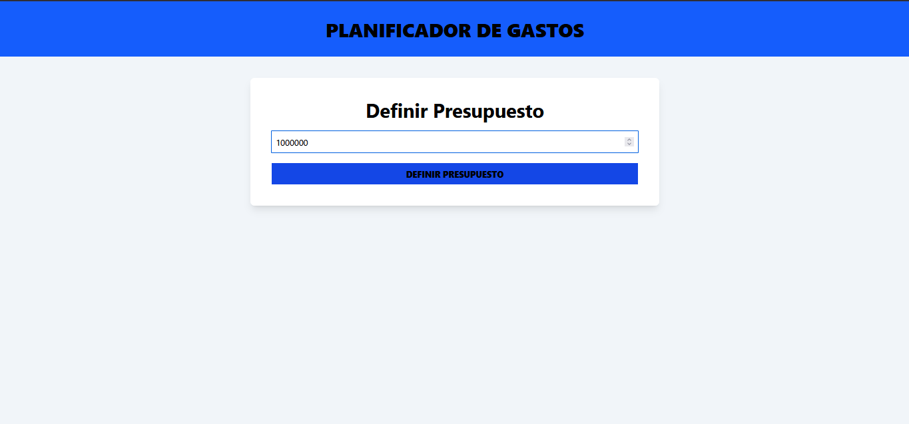
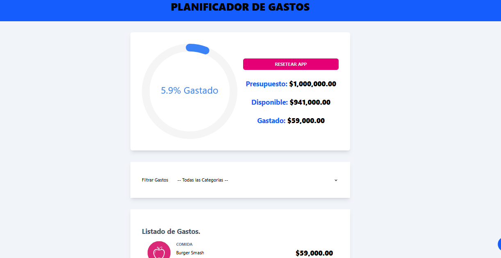
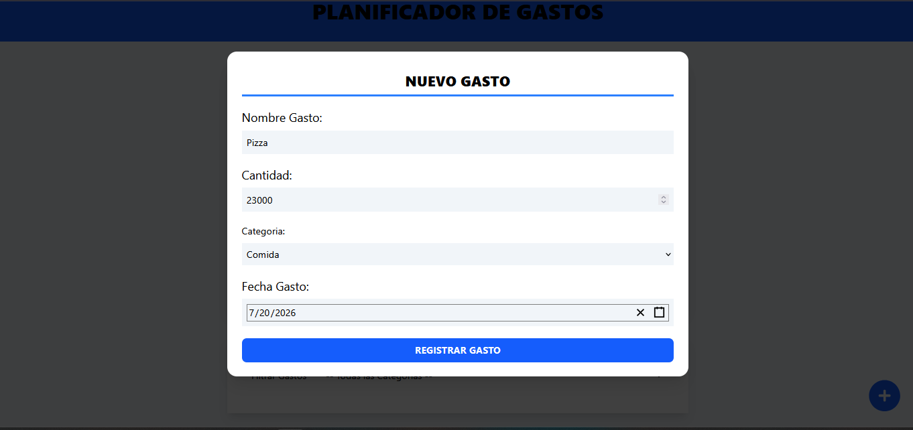

# 📊 Expense Planner (Planificador de Gastos)

<div align="center">
  
  
  
  
  
</div>

<br />

**Expense Planner** is a modern, responsive, and intuitive client-side application designed to help users control their finances. It enables budget allocation, real-time expenditure monitoring with dynamic progress visualization, categorized filtering, and fluid gesture-based expense management.

### 🚀 **Live Demo:** [Expense Manager](https://expense-manager-jet-chi.vercel.app/)

---

## 📖 Table of Contents

- [Overview](#-overview)
- [Key Features](#-key-features)
- [Tech Stack](#-tech-stack)
- [Architecture & Patterns](#-architecture--patterns)
- [Getting Started](#-getting-started)
- [Project Structure](#-project-structure)
- [Screenshots](#-screenshots)
- [Author](#-author)

---

## 🎯 Overview

Expense Planner provides a seamless, single-page interactive dashboard split into two main states:

1. **Initial Budget Setup**: A simple entry form that registers the user's initial budget.
2. **Interactive Tracker Dashboard**: Once the budget is established, the application displays a real-time tracking ring (spent percentage), breakdown displays (total budget, remaining budget, spent amount), a quick action category filter, a transaction log, and a modal form to create/edit expenses.

---

## ✨ Key Features

### 💰 Budget Management
- **Initial Setup:** Enter your starting capital to boot the dashboard.
- **Budget Tracking Ring:** A beautiful circular progress bar that updates dynamically as expenses are recorded. The path changes colors (e.g., shifts to red at 100% consumption) to visually alert the user.
- **Detailed Summary:** Real-time calculation showing original budget, remaining funds, and cumulative expenses.

### 📝 Expense Operations
- **Dynamic Creation & Editing:** Add description, amount, category, and date.
- **Accessible Modals:** Powered by Headless UI to present creation and modification interfaces without cluttering the screen.
- **Validation:** Visual inline warnings prevent saving empty fields or values exceeding the remaining budget.

### 📱 Swipe-to-Action Gestures
- **Swipe Right to Edit:** Instantly opens the edit form pre-populated with details.
- **Swipe Left to Delete:** Safely removes the transaction from the list.

### 🔍 Filtering & Data Persistence
- **Category Filter:** Instantly filter expenses down to Ahorro, Comida, Casa, Gastos Varios, Ocio, Salud, or Suscripciones.
- **Local Storage Integration:** Automatic persistence keeps all inputs and configurations intact across page refreshes.

---

## 🛠 Tech Stack

Built with modern web development best practices:

- **Frontend Library:** [React 19](https://react.dev/)
- **Language:** [TypeScript](https://www.typescriptlang.org/) for complete type safety
- **Build Tool:** [Vite](https://vite.dev/) (fast HMR and building pipeline)
- **Styling:** [Tailwind CSS v4](https://tailwindcss.com/) with native Vite integration (`@tailwindcss/vite`)
- **State Management:** React **Context API** combined with **useReducer** for clean state segregation
- **UI Components & Icons:**
  - `@headlessui/react` (Accessible modals)
  - `react-swipeable-list` (Native-like swipe gestures)
  - `react-circular-progressbar` (Progress visualization)
  - `react-date-picker` (Interactive calendars)
  - `uuid` (Unique transaction IDs)

---

## 🏗 Architecture & Patterns

- **Context API + Reducer Pattern:** Global state is centrally managed via a pure reducer function in `reducer-budget.ts`, decoupling state transitions from UI code.
- **Custom Hooks:** Exposes the React context safely via the `useBudget` custom hook, reducing boilerplate consumption.
- **Strong Typings:** End-to-end type safety for components, actions, state, categories, and raw records.

---

## 🚀 Getting Started

### Prerequisites

- [Node.js](https://nodejs.org/) (v18 or higher)
- `npm` or `yarn`

### Installation

1. **Clone the repository:**
   ```bash
   git clone https://github.com/CamiloVelasquezBotero/Expense_Manager.git
   cd Expense_Manager
   ```

2. **Install dependencies:**
   ```bash
   npm install
   ```

3. **Start the development server:**
   ```bash
   npm run dev
   ```
   Open [http://localhost:5173](http://localhost:5173) in your browser.

4. **Build for Production:**
   ```bash
   npm run build
   ```

---

## 📁 Project Structure

```text
Expense_Manager/
├── src/
│   ├── components/            # Reusable UI & Layout Components
│   │   ├── AmountDisplay.tsx  # Formats and displays currency details
│   │   ├── BudgetForm.tsx     # Initial entry form for setting budget
│   │   ├── BudgetTraker.tsx   # Budget progress ring and reset trigger
│   │   ├── ErrorMessage.tsx   # Inline styling for form alerts
│   │   ├── ExpenseDetail.tsx  # Wrapper for individual list elements
│   │   ├── ExpenseForm.tsx    # Modal form for creation and editing
│   │   ├── ExpenseList.tsx    # Scrollable container mapping expense items
│   │   ├── ExpenseModal.tsx   # Accessible popup overlay
│   │   ├── FilterByCategory.tsx # Category selector dropdown
│   │   └── SwipeableItem.tsx  # Swipe controller for list items
│   │
│   ├── context/               # Global state provider initialization
│   │   └── BudgetContext.tsx  # Context definition and useMemo calculation layer
│   │
│   ├── data/
│   │   └── categories.ts      # Categories list with localized names and icon tags
│   │
│   ├── helpers/
│   │   └── index.ts           # Date formatting utility helper functions
│   │
│   ├── hooks/
│   │   └── useBudget.ts       # Custom Hook for boilerplate-free context usage
│   │
│   ├── reducers/
│   │   └── reducer-budget.ts  # State transitions, actions types, and storage logic
│   │
│   ├── types/
│   │   └── index.ts           # Global type definitions (Expense, Category, etc.)
│   │
│   ├── App.tsx                # Main Router/Layout logic
│   ├── index.css              # Custom Tailwind configuration and styles
│   └── main.tsx               # App entrypoint
```

---

## 📸 Screenshots

<details>
<summary>Click to view screenshots</summary>

- **Budget Entry Screen:** 
- **Dashboard Overview:** 
- **Add Expense Modal:** 

</details>

---

## 👨💻 Author

**Camilo Velásquez Botero**  
Full Stack Web Developer  
- [GitHub](https://github.com/CamiloVelasquezBotero)
- [LinkedIn](https://www.linkedin.com/in/camilodeveloper)

---
*If you liked this project, please consider giving it a ⭐ on GitHub!*
