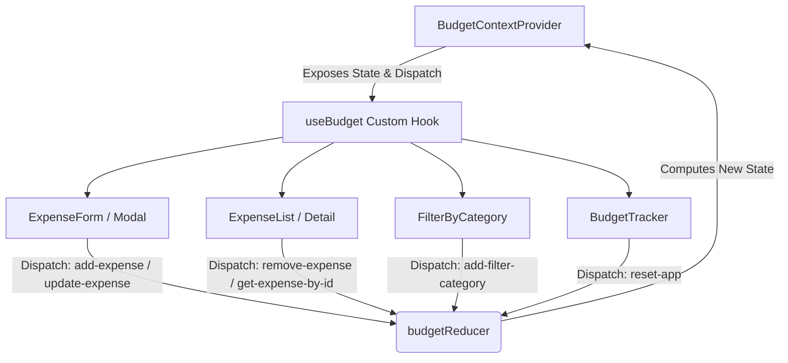

# 📊 Expense Planner (Planificador de Gastos)

A modern, highly interactive, and responsive personal finance application built with **React**, **TypeScript**, **Vite**, and **Tailwind CSS v4**. This project showcases clean code practices, custom hooks, and state management using the **React Context API** paired with the **useReducer** pattern.

Designed with a focus on seamless user experience (UX) and visual polish, the application helps users allocate a budget, track expenditures in real-time, filter transactions by category, and manage records via fluid swipeable actions.

---

## 🚀 Key Features

*   **Smart Budget Tracking**: Input your starting budget to unlock the main control panel. Watch your available balance and spending metrics update instantly.
*   **Dynamic Progress Visualization**: An interactive circular progress bar (`react-circular-progressbar`) dynamically visualizes the percentage of the budget spent, changing path color to alert the user when limits are reached.
*   **Intuitive Transaction Management**: Add, update, and delete expenses. Includes custom date-picking capability and input validation.
*   **Bespoke Categorization**: Categorize your spending (e.g., Savings, Food, Home, Health, Leisure, Utilities, Subscriptions) with beautiful SVG icons.
*   **Dynamic Filtering**: Instantly filter your list of expenses by category to analyze spending patterns.
*   **Swipe to Action**: Interactive mobile-friendly list items using `react-swipeable-list`—swipe right to edit/update and swipe left to delete.
*   **Local Storage Persistence**: State is automatically persisted in the browser's `localStorage` so users never lose their budget or expense data on page refresh.

---

## 🛠️ Tech Stack & Tools

*   **Frontend Library**: [React 19](https://react.dev/)
*   **Language**: [TypeScript](https://www.typescriptlang.org/) for complete type safety and robust developer experience
*   **Build Tool & Dev Server**: [Vite](https://vite.dev/) (fast HMR and building pipeline)
*   **Styling**: [Tailwind CSS v4](https://tailwindcss.com/) with native Vite integration (`@tailwindcss/vite`)
*   **State Management**: React **Context API** combined with **useReducer** for clean state segregation
*   **Interactions & UI components**:
    *   `react-swipeable-list` for native-feeling swipe gestures
    *   `react-circular-progressbar` for spending metrics visualization
    *   `react-date-picker` for date selection
    *   `@headlessui/react` for accessible modal overlays
*   **Utilities**: `uuid` for secure unique identifier generation

---

## 📐 Architecture & State Flow

The application utilizes a unidirectionally-managed state powered by a Reducer pattern. This separation of concerns simplifies testing and debugging.



### Supported Reducer Actions

Located in `src/reducers/reducer-budget.ts`:
*   `add-budget`: Sets the primary budget threshold.
*   `show-modal` / `close-modal`: Controls modal visibility for expense creation/editing.
*   `add-expense`: Saves a new expense and generates a unique ID using `uuid`.
*   `remove-expense`: Deletes an expense by its ID.
*   `get-expense-by-id`: Pre-populates the modal for editing an existing item.
*   `update-expense`: Commits edits back to the expense collection.
*   `reset-app`: Clears all state and local storage data, bringing the user back to the setup step.
*   `add-filter-category`: Restricts the visible list to a chosen category.

---

## 📁 File Structure

```text
expense-manager/
├── src/
│   ├── components/            # Reusable UI & Layout Components
│   │   ├── AmountDisplay.tsx  # Formats and displays currency details
│   │   ├── BudgetForm.tsx     # Initial entry form for setting budget
│   │   ├── BudgetTraker.tsx   # Budget progress ring and reset trigger
│   │   ├── ErrorMessage.tsx   # Inline styling for form alerts
│   │   ├── ExpenseDetail.tsx  # Wrapper for individual list elements
│   │   ├── ExpenseForm.tsx    # Modal form for creation and editing
│   │   ├── ExpenseList.tsx    # Scrollable container mapping expense items
│   │   ├── ExpenseModal.tsx   # Accessible popup overlay
│   │   ├── FilterByCategory.tsx # Category selector dropdown
│   │   └── SwipeableItem.tsx  # Swipe controller for list items
│   │
│   ├── context/               # Global state provider initialization
│   │   └── BudgetContext.tsx  # Context definition and useMemo calculation layer
│   │
│   ├── data/
│   │   └── categories.ts      # Categories list with localized names and icon tags
│   │
│   ├── helpers/
│   │   └── index.ts           # Date formatting utility helper functions
│   │
│   ├── hooks/
│   │   └── useBudget.ts       # Custom Hook for boilerplate-free context usage
│   │
│   ├── reducers/
│   │   └── reducer-budget.ts  # State transitions, actions types, and storage logic
│   │
│   ├── types/
│   │   └── index.ts           # Global type definitions (Expense, Category, etc.)
│   │
│   ├── App.tsx                # Main Router/Layout logic
│   ├── index.css              # Custom Tailwind configuration and styles
│   └── main.tsx               # App entrypoint
```

---

## ⚙️ Installation & Getting Started

Follow these steps to run the project locally.

### Prerequisites

Ensure you have [Node.js](https://nodejs.org/) installed (v18+ recommended) and `npm` or `yarn`.

### Steps

1.  **Clone the Repository**:
    ```bash
    git clone https://github.com/your-username/expense-planner.git
    cd expense-planner
    ```

2.  **Install Dependencies**:
    ```bash
    npm install
    ```

3.  **Run Development Server**:
    ```bash
    npm run dev
    ```
    The application will run locally at [http://localhost:5173](http://localhost:5173).

4.  **Build for Production**:
    ```bash
    npm run build
    ```
    Creates optimized static files in the `/dist` folder.

---

## 🌟 Highlights for Recruiters

*   **Clean Architecture**: Separation of UI components, custom hooks, and business logic (via Reducer).
*   **Strong Typings**: Deeply integrated TypeScript definitions ensuring zero implicit `any` and full safety across component props and payloads.
*   **Tailwind CSS v4 Integration**: Uses the newest CSS-first Vite plugin for outstanding performance and build times.
*   **Modern Web APIs**: Practical integration with `localStorage` for responsive client-side persistence.
*   **Interactive UI Patterns**: Mobile-responsive swipeable gestures, accessible dialog modal components, and dynamic HSL color shifts depending on the utilization threshold.
